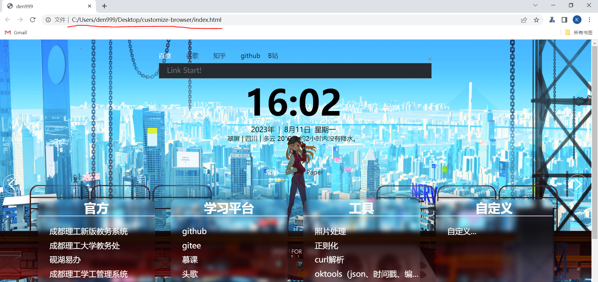
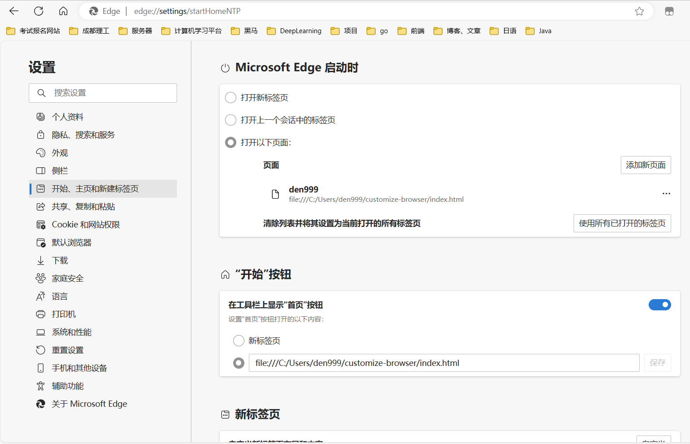

# Custom Browser Homepage (自定义浏览器首页)

Jump to: [English](#english-version) | [中文](#中文版本)

---

## English Version

### Introduction

This project provides a customizable browser homepage that enhances your web browsing experience by offering unique features and easy navigation.

Set `file:///C:/path-to-your-folder/customize-browser/index.html` as your browser's homepage.

#### Setting the Homepage

The method to set the homepage varies across different browsers. Refer to the specific instructions for your browser.

**Note:** It may be necessary to disable browser protection in your antivirus software.

#### How to Customize Navigation Content:

Modify the content directly in `customize-browser/index.html`.

#### Features:

1. **Weather Forecast**: The application automatically fetches weather forecasts based on saved latitude and longitude information. If there's any discrepancy in location, manually set the LocalStorage for corrections.

2. **Background Image**: Replace the `background.png` file in the `localdata` folder to change the background.

---

## 中文版本

### 介绍

这个项目提供了一个可自定义的浏览器主页，通过提供独特的功能和简便的导航，增强您的网页浏览体验。

将 `file:///C:/您的文件夹路径/customize-browser/index.html` 设置为您的浏览器主页。

#### 设置主页

在不同的浏览器中设置主页的方法各不相同。请参考您浏览器的具体指导。

**注意：** 可能需要在您的杀毒软件中禁用浏览器保护。

#### 如何自定义导航内容：

直接在 `customize-browser/index.html` 中修改内容。

#### 功能说明：

1. **天气预报**：应用根据保存的经纬度信息自动获取天气预报。如果位置有偏差，可手动设置 LocalStorage 进行更正。

2. **背景图片**：更换 `localdata` 文件夹中的 `background.png` 文件即可更改背景。
